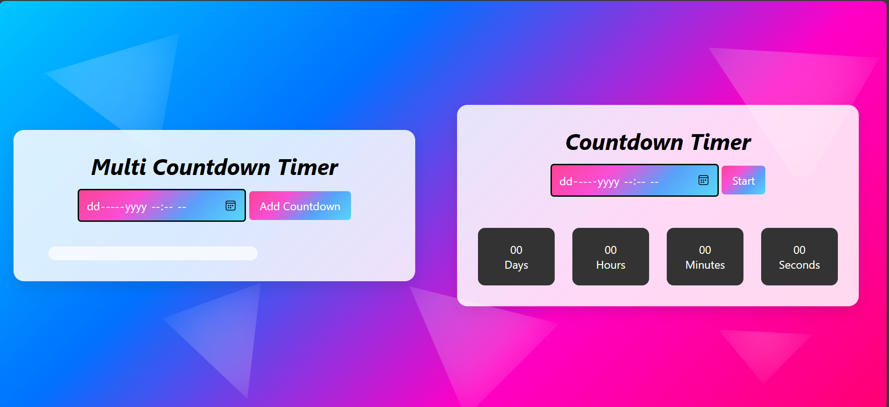

# Countdown Timer

## Description
A dynamic countdown timer web application that allows users to create and manage multiple countdowns simultaneously. The project is built using JavaScript and focuses on real-time updates and clean user interaction.

## Features
- Create multiple countdown timers
- Real-time countdown updates
- User-friendly and interactive UI
- Supports multiple events at the same time
- Fully client-side (no backend required)

## Live Demo
🔗 https://anshu-dha.github.io/countdown-timer/

## Tech Stack
- HTML
- CSS
- JavaScript

## Use Case
This project can be used for:
- Event countdowns
- Exam or deadline tracking
- Product launch timers
- Personal reminders

## Learning Outcome
- JavaScript timers (`setInterval`)
- DOM manipulation
- Managing multiple dynamic states
- Clean project structuring

## Preview

